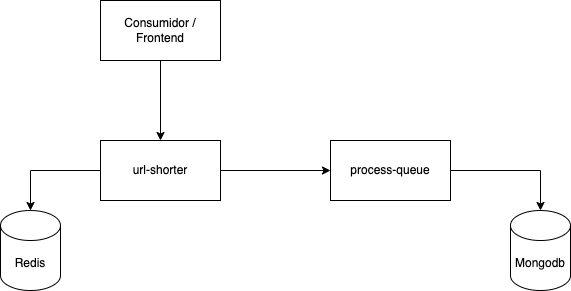
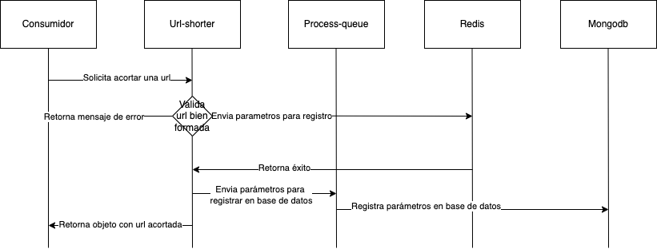

# url-shorter-challenge

Este proyecto consta de dos servicios principales construidos con Node.js y NestJS, y utiliza Redis y MongoDB para el almacenamiento y caché. El sistema permite acortar URLs y almacenar la información en MongoDB para consultas posteriores.

## Arquitectura del Sistema

### Servicios

1. **url-shorter**

   - Responsable de generar URLs cortas y redirigir a las URLs originales.
   - Utiliza Redis para caché.
   - Envia URLs a `process-queue` para su almacenamiento en MongoDB.

2. **process-queue**
   - Recibe y almacena URLs en una base de datos MongoDB.
   - Provee APIs para operaciones CRUD sobre las URLs.

### Diagrama de Componentes



### Diagrama de funcionalidad



## Comandos para Levantar el Proyecto

### Prerequisitos

- Docker y Docker Compose instalados en tu máquina.
- Configuración del entorno Swarm para Docker.

### Versiones recomendadas

- Docker = Docker version 27.0.3, build 7d4bcd8
- Docker compose = Docker Compose version v2.28.1-desktop.1
- Node = v16.16.0
- npm = 8.11.0
- redis-cli = redis-cli 7.2.5
- Mongo = MongoDB shell version v5.0.28

### Levantar el Sistema

1. **Realizar build de los proyectos**

   ```sh
   docker build -t url-shorter:latest ./url-shorter
   docker build -t process-queue:latest ./process-queue
   ```

2. **Inicializa Docker Swarm (si no está inicializado)**

   ```sh
   docker swarm init
   ```

3. **Creación de red para comunicación entre los servicios**

   ```sh
   docker network create --driver overlay my-network-overlay
   ```

4. **Levantar los servicios**

   ```sh
   docker stack deploy -c docker-compose.yml my_stack
   ```

### Verificar que los servicios estén corriendo

Para verificar que los servicios están corriendo correctamente, usa el siguiente comando:

    ```sh
    docker stack services url-shortener
    ```

### Documentación y consumo

Ambas piezas constan de su propia configuración de Swagger

    ```sh
    url-shorter: http://localhost:3001/api
    process-queue: http://localhost:3002/api
    ```
